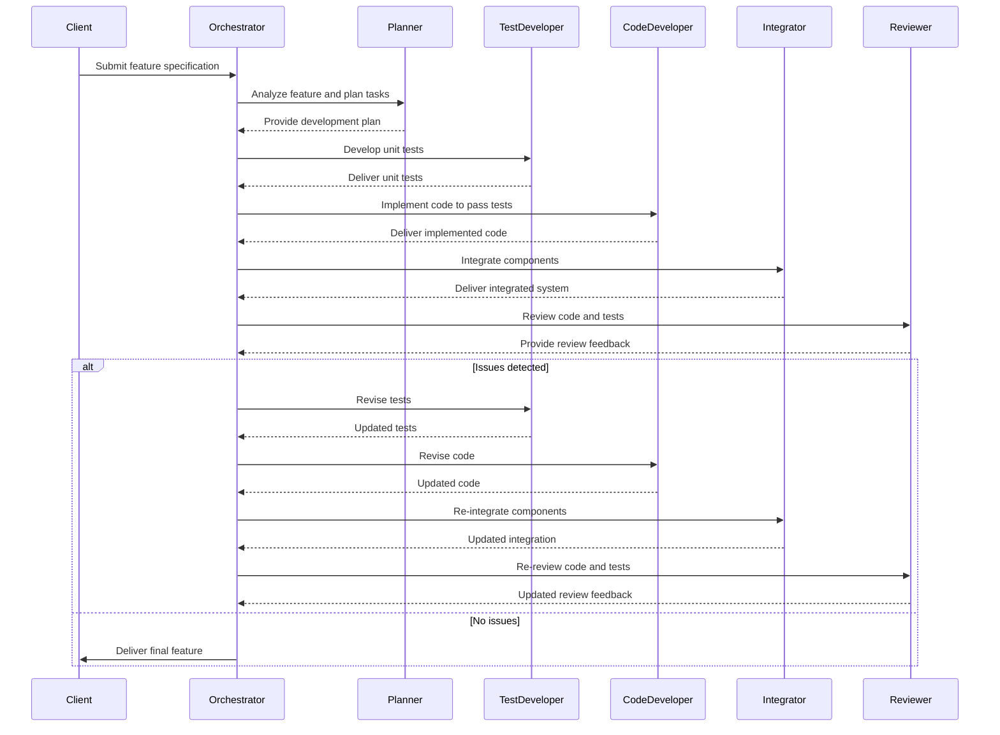

https://chatgpt.com/share/67bd3a39-00a8-8006-84b5-6157da1859a6

```mermaid
sequenceDiagram
    participant Client
    participant Orchestrator
    participant Planner
    participant TestDeveloper
    participant CodeDeveloper
    participant Integrator
    participant Reviewer

    Client->>Orchestrator: Submit feature specification
    Orchestrator->>Planner: Analyze feature and plan tasks
    Planner-->>Orchestrator: Provide development plan
    Orchestrator->>TestDeveloper: Develop unit tests
    TestDeveloper-->>Orchestrator: Deliver unit tests
    Orchestrator->>CodeDeveloper: Implement code to pass tests
    CodeDeveloper-->>Orchestrator: Deliver implemented code
    Orchestrator->>Integrator: Integrate components
    Integrator-->>Orchestrator: Deliver integrated system
    Orchestrator->>Reviewer: Review code and tests
    Reviewer-->>Orchestrator: Provide review feedback

    alt Issues detected
        Orchestrator->>TestDeveloper: Revise tests
        TestDeveloper-->>Orchestrator: Updated tests
        Orchestrator->>CodeDeveloper: Revise code
        CodeDeveloper-->>Orchestrator: Updated code
        Orchestrator->>Integrator: Re-integrate components
        Integrator-->>Orchestrator: Updated integration
        Orchestrator->>Reviewer: Re-review code and tests
        Reviewer-->>Orchestrator: Updated review feedback
    else No issues
        Orchestrator->>Client: Deliver final feature
    end
```
