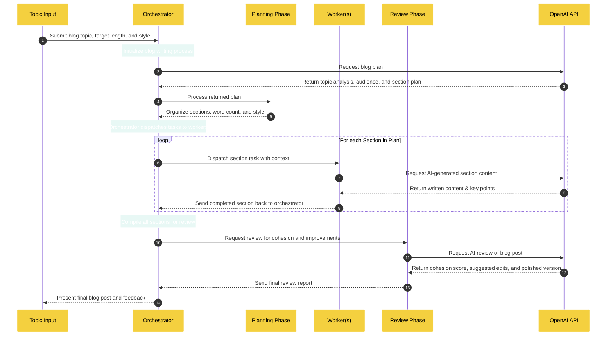

```mermaid
%%{init: {'theme': 'default', 'themeVariables': { 
    'actorBkg': '#F4D03F', 'actorBorder': '#fff', 
    'actorFontSize': '18px', 'actorFontWeight': 'bold',
    'sequenceNumberColor': '#FFFFFF', 'sequenceTextSize': '16px',
    'noteBkgColor': '#E8F8F5', 'noteTextColor': '#FFFFFF',
    'noteBorderColor': '#fff', 'messageTextColor': '#FFFFFF'
}}}%%

sequenceDiagram
    autonumber
    participant UI as Topic Input
    participant O as Orchestrator
    participant P as Planning Phase
    participant W as Worker(s)
    participant R as Review Phase
    participant API as OpenAI API

    UI->>O: Submit blog topic, target length, and style
    Note over O: Initialize blog writing process
    
    O->>API: Request blog plan
    API-->>O: Return topic analysis, audience, and section plan
    
    O->>P: Process returned plan
    P-->>O: Organize sections, word count, and style
    
    Note over O: Orchestrator dispatches tasks to workers

    loop For each Section in Plan
        O->>W: Dispatch section task with context
        W->>API: Request AI-generated section content
        API-->>W: Return written content & key points
        W-->>O: Send completed section back to orchestrator
    end

    Note over O: Compile all sections for review
    
    O->>R: Request review for cohesion and improvements
    R->>API: Request AI review of blog post
    API-->>R: Return cohesion score, suggested edits, and polished version
    R-->>O: Send final review report

    O-->>UI: Present final blog post and feedback


```
