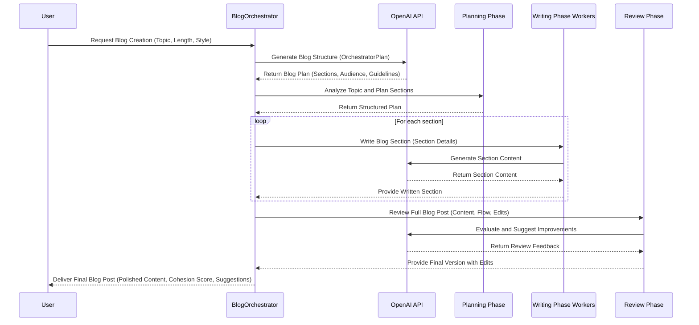

```mermaid
sequenceDiagram
    participant User as User
    participant Orchestrator as BlogOrchestrator
    participant OpenAI as OpenAI API
    participant Planner as Planning Phase
    participant Workers as Writing Phase Workers
    participant Reviewer as Review Phase

    User->>Orchestrator: Request Blog Creation (Topic, Length, Style)
    Orchestrator->>OpenAI: Generate Blog Structure (OrchestratorPlan)
    OpenAI-->>Orchestrator: Return Blog Plan (Sections, Audience, Guidelines)

    Orchestrator->>Planner: Analyze Topic and Plan Sections
    Planner-->>Orchestrator: Return Structured Plan

    loop For each section
        Orchestrator->>Workers: Write Blog Section (Section Details)
        Workers->>OpenAI: Generate Section Content
        OpenAI-->>Workers: Return Section Content
        Workers-->>Orchestrator: Provide Written Section
    end

    Orchestrator->>Reviewer: Review Full Blog Post (Content, Flow, Edits)
    Reviewer->>OpenAI: Evaluate and Suggest Improvements
    OpenAI-->>Reviewer: Return Review Feedback
    Reviewer-->>Orchestrator: Provide Final Version with Edits

    Orchestrator-->>User: Deliver Final Blog Post (Polished Content, Cohesion Score, Suggestions)
```
